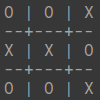

# Tic Tac Toe - AI Game Player
<center></center>

TicTacToe or X-O is a well-known game that has been played by almost everyone during their student days. This project is about creating an intelligent game-playing agent that can never be beaten in TicTacToe.

Implemented in C++, the *MiniMax Algorithm* is used along with *Alpha-Beta Pruning* to develop the game-playing agent.

## Running the Game
#### Clone the Repository

```bash
git clone https://github.com/z0o0p/TicTacToe.git
cd TicTacToe/src
```

#### Compile and Run

```bash
g++ -o tictactoe tictactoe.cpp
./tictactoe
```

## Performance
Tic-Tac-Toe is a fairly simple game to play. But when carefully observed, there are 9! (9 x 8 x 7 ... 3 x 2 x 1 = 362880) possible states for the game board.

For the first move, with the *MiniMax Algorithm* alone, the game-playing agent takes an average of around 1.05 seconds. But with *Alpha-Beta Pruning* implemented, the time taken is **reduced to 40% of the original time taken** (≈ 0.40 seconds). The subsequent moves take a marginal amount of time compared to the first move as the possible combinations keep decreasing.

Hence, it makes it **impossible to defeat the game-playing agent** as it makes the most optimal move every time with the minimal time taken.

Other optimization techniques like *Evaluation Functions* or *Iterative Deepening* could be used to further restrict the time constraints. But with this project in context, it won't make much of a difference.